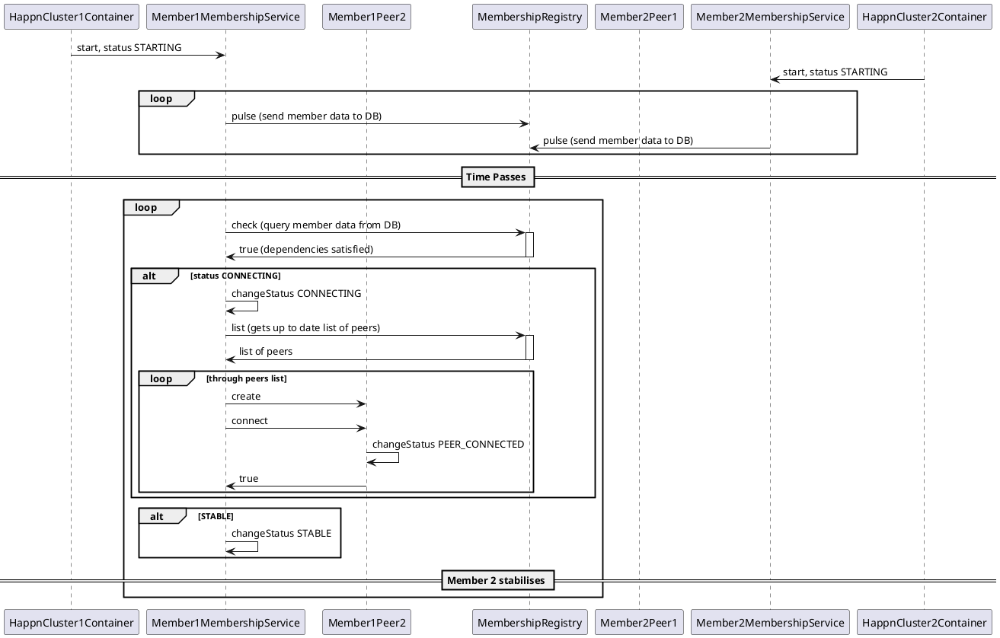

membership state machine
-------------------------
### assuming we have 2 members with circular dependencies

```plantuml
@startuml
participant HappnCluster1Container
participant Member1MembershipService
participant Member1Peer2
participant MembershipRegistry
participant Member2Peer1
participant Member2MembershipService
participant HappnCluster2Container
HappnCluster1Container->Member1MembershipService:start, status STARTING
HappnCluster2Container->Member2MembershipService:start, status STARTING
loop
Member1MembershipService->MembershipRegistry:pulse (send member data to DB)
Member2MembershipService->MembershipRegistry:pulse (send member data to DB)
end
== Time Passes ==
loop
Member1MembershipService->MembershipRegistry:check (query member data from DB)
activate MembershipRegistry
MembershipRegistry->Member1MembershipService:true (dependencies satisfied)
deactivate MembershipRegistry
alt status CONNECTING
Member1MembershipService->Member1MembershipService: changeStatus CONNECTING
Member1MembershipService->MembershipRegistry: list (gets up to date list of peers)
activate MembershipRegistry
MembershipRegistry->Member1MembershipService: list of peers
deactivate MembershipRegistry
loop through peers list
Member1MembershipService->Member1Peer2: create
Member1MembershipService->Member1Peer2: connect
Member1Peer2->Member1Peer2: changeStatus PEER_CONNECTED
Member1Peer2->Member1MembershipService: true
end
end
alt STABLE
Member1MembershipService->Member1MembershipService: changeStatus STABLE
end
== Member 2 stabilises ==
end
@enduml
```
